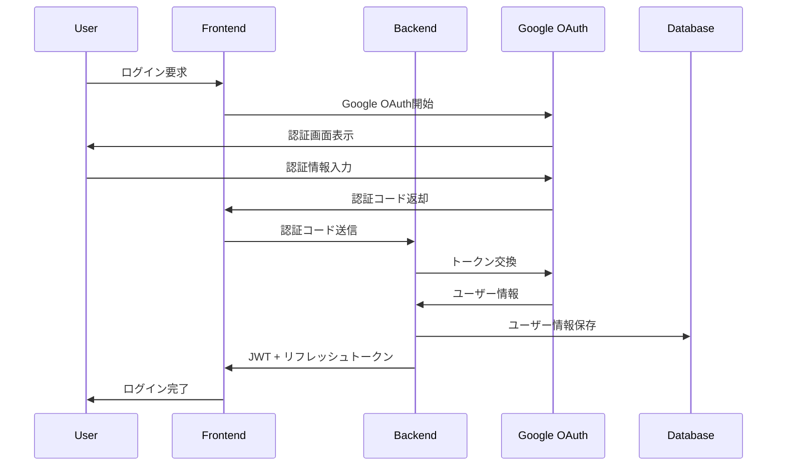

# 🏗️ QuestBoard 技術仕様書

## 📋 概要

この文書は、QuestBoard（冒険者クエスト掲示板）の包括的な技術仕様書です。システムアーキテクチャ、実装詳細、運用要件などを詳述しています。

**プロジェクト概要**
- **名称**: QuestBoard - 冒険者クエスト掲示板
- **種別**: エンタープライズレベルWebアプリケーション
- **アーキテクチャ**: マイクロサービス + PWA
- **デプロイ**: Kubernetes (AWS EKS)
- **更新日**: 2024年7月14日

## 🎯 システム要件

### 機能要件
1. **認証・認可**
   - Google OAuth 2.0統合
   - 2要素認証（2FA）
   - ロールベースアクセス制御（RBAC）
   - セッション管理・JWT トークン

2. **クエスト管理**
   - クエスト作成・編集・削除
   - ステータス管理（未受注・進行中・完了）
   - 評価・レビューシステム
   - 検索・フィルタリング機能

3. **ユーザー管理**
   - プロフィール管理
   - 権限管理（一般・管理者）
   - 活動履歴・統計
   - リーダーボード

4. **リアルタイム機能**
   - WebSocket通信
   - リアルタイム通知
   - 協調編集機能
   - オンライン状態表示

### 非機能要件
1. **パフォーマンス**
   - 初期表示: < 2秒
   - API応答時間: < 500ms
   - 同時接続: 10,000+ユーザー
   - スループット: 1,000 RPS

2. **可用性**
   - SLA: 99.9%
   - 復旧時間: < 4時間
   - 最大計画停止時間: 月4時間
   - 自動フェイルオーバー

3. **セキュリティ**
   - TLS 1.3暗号化
   - OWASP Top 10対応
   - 脆弱性スキャン
   - セキュリティ監査

4. **スケーラビリティ**
   - 水平スケーリング対応
   - 自動スケーリング
   - マイクロサービス構成
   - 地理的分散

## 🏛️ システムアーキテクチャ

### 全体構成
```
┌─────────────────────────────────────────────────────────────┐
│                        Internet                             │
└─────────────────────┬───────────────────────────────────────┘
                      │
┌─────────────────────▼───────────────────────────────────────┐
│                   CloudFront                                │
│                 (CDN + WAF)                                 │
└─────────────────────┬───────────────────────────────────────┘
                      │
┌─────────────────────▼───────────────────────────────────────┐
│                      ALB                                    │
│            (Application Load Balancer)                     │
└─────────────────────┬───────────────────────────────────────┘
                      │
┌─────────────────────▼───────────────────────────────────────┐
│                  EKS Cluster                                │
│  ┌─────────────────┐    ┌─────────────────┐                │
│  │    Frontend     │    │    Backend      │                │
│  │   (React PWA)   │    │   (Node.js)     │                │
│  │                 │    │                 │                │
│  │ • Service Worker│    │ • Express API   │                │
│  │ • React Query   │    │ • Socket.io     │                │
│  │ • WebSocket     │    │ • Passport.js   │                │
│  └─────────────────┘    └─────────────────┘                │
└─────────────────────┬───────────────────────────────────────┘
                      │
┌─────────────────────▼───────────────────────────────────────┐
│                  Data Layer                                 │
│  ┌─────────────┐  ┌─────────────┐  ┌─────────────┐         │
│  │ PostgreSQL  │  │    Redis    │  │    S3       │         │
│  │    (RDS)    │  │(ElastiCache)│  │  (Storage)  │         │
│  │             │  │             │  │             │         │
│  │ • Users     │  │ • Sessions  │  │ • Files     │         │
│  │ • Quests    │  │ • Cache     │  │ • Backups   │         │
│  │ • Logs      │  │ • Queues    │  │ • Assets    │         │
│  └─────────────┘  └─────────────┘  └─────────────┘         │
└─────────────────────────────────────────────────────────────┘
```

### マイクロサービス構成
```
┌─────────────────────────────────────────────────────────────┐
│                    API Gateway                              │
│                  (Kong / Nginx)                             │
└─────────────────────┬───────────────────────────────────────┘
                      │
         ┌────────────┼────────────┐
         │            │            │
┌────────▼────┐ ┌─────▼─────┐ ┌───▼────┐
│   Auth      │ │   Quest   │ │  User  │
│  Service    │ │  Service  │ │Service │
│             │ │           │ │        │
│ • OAuth     │ │ • CRUD    │ │ • CRUD │
│ • JWT       │ │ • Search  │ │ • Stats│
│ • 2FA       │ │ • Rating  │ │ • Roles│
└─────────────┘ └───────────┘ └────────┘
```

## 🛠️ 技術スタック詳細

### フロントエンド技術
```typescript
// 主要フレームワーク
React 18.2.0             // UIライブラリ
TypeScript 5.0           // 型安全性
React Router 6.8         // ルーティング
React Query 4.24         // データフェッチ・キャッシュ

// 状態管理
Zustand 4.3              // 軽量状態管理
Context API              // グローバル状態

// UI・スタイリング
CSS Modules              // スタイリング
React Virtual            // 仮想化リスト
Framer Motion            // アニメーション

// PWA・パフォーマンス
Workbox 6.5              // Service Worker
Web Vitals               // パフォーマンス測定
React.memo               // メモ化
useMemo/useCallback      // 最適化

// 通信・データ
Axios 1.3                // HTTP クライアント
Socket.io Client 4.6     // WebSocket
React Hook Form 7.43     // フォーム管理
```

### バックエンド技術
```javascript
// コア技術
Node.js 18.15.0          // ランタイム
Express 4.18.2           // Webフレームワーク
TypeScript 5.0           // 型安全性（一部）

// データベース・ORM
PostgreSQL 15            // メインDB
Sequelize 6.28           // ORM
Redis 7.0                // キャッシュ・セッション
Bull 4.10                // ジョブキュー

// 認証・セキュリティ
Passport.js 0.6          // 認証戦略
jsonwebtoken 9.0         // JWT
bcrypt 5.1               // パスワードハッシュ
helmet 6.0               // セキュリティヘッダー
cors 2.8                 // CORS制御

// 通信・リアルタイム
Socket.io 4.6            // WebSocket
Express Rate Limit 6.7   // レート制限

// 監視・ログ
Winston 3.8              // ログ管理
Prometheus Client 14.1   // メトリクス
Morgan 1.10              // アクセスログ

// バリデーション・ユーティリティ
Joi 17.7                 // スキーマ検証
Lodash 4.17              // ユーティリティ
Moment.js 2.29           // 日付処理
```

### インフラ技術
```yaml
# コンテナ・オーケストレーション
Docker 24.0              # コンテナ化
Kubernetes 1.28          # オーケストレーション
AWS EKS 1.28             # マネージドK8s

# Infrastructure as Code
Terraform 1.5            # インフラ管理
Helm 3.12                # K8sパッケージ管理

# AWS サービス
EC2 / EKS                # コンピューティング
RDS PostgreSQL           # データベース
ElastiCache Redis        # キャッシュ
S3                       # ストレージ
CloudFront               # CDN
ALB                      # ロードバランサー
Route 53                 # DNS
WAF                      # セキュリティ
Systems Manager          # 設定管理
```

### 監視・運用技術
```yaml
# メトリクス・監視
Prometheus 2.45          # メトリクス収集
Grafana 10.0             # 可視化
AlertManager 0.25        # アラート管理
Node Exporter 1.6       # システムメトリクス

# ログ管理
Loki 2.8                 # ログ集約
Promtail 2.8             # ログ収集
Elasticsearch 8.8        # 検索・分析
Kibana 8.8               # ログ可視化

# 分散トレーシング
Jaeger 1.46              # トレーシング
OpenTelemetry 1.15       # テレメトリ
```

## 🗄️ データベース設計

### ERD（Entity Relationship Diagram）
```sql
-- ユーザーテーブル
CREATE TABLE users (
    id SERIAL PRIMARY KEY,
    google_id VARCHAR(255) UNIQUE NOT NULL,
    email VARCHAR(255) UNIQUE NOT NULL,
    name VARCHAR(255) NOT NULL,
    avatar_url VARCHAR(500),
    role VARCHAR(50) DEFAULT 'user',
    is_active BOOLEAN DEFAULT true,
    two_factor_enabled BOOLEAN DEFAULT false,
    two_factor_secret VARCHAR(255),
    created_at TIMESTAMP DEFAULT CURRENT_TIMESTAMP,
    updated_at TIMESTAMP DEFAULT CURRENT_TIMESTAMP,
    last_login_at TIMESTAMP,
    login_count INTEGER DEFAULT 0
);

-- クエストテーブル
CREATE TABLE quests (
    id SERIAL PRIMARY KEY,
    title VARCHAR(255) NOT NULL,
    description TEXT,
    content TEXT,
    reward VARCHAR(500),
    difficulty VARCHAR(10) CHECK (difficulty IN ('S', 'A', 'B', 'C', 'D')),
    status VARCHAR(20) DEFAULT 'available',
    category VARCHAR(100),
    estimated_time INTEGER,
    created_by INTEGER REFERENCES users(id),
    assigned_to INTEGER REFERENCES users(id),
    created_at TIMESTAMP DEFAULT CURRENT_TIMESTAMP,
    updated_at TIMESTAMP DEFAULT CURRENT_TIMESTAMP,
    due_date TIMESTAMP,
    completed_at TIMESTAMP,
    approved_at TIMESTAMP,
    approved_by INTEGER REFERENCES users(id)
);

-- クエスト評価テーブル
CREATE TABLE quest_ratings (
    id SERIAL PRIMARY KEY,
    quest_id INTEGER REFERENCES quests(id),
    user_id INTEGER REFERENCES users(id),
    rating INTEGER CHECK (rating >= 1 AND rating <= 5),
    comment TEXT,
    created_at TIMESTAMP DEFAULT CURRENT_TIMESTAMP,
    UNIQUE(quest_id, user_id)
);

-- 通知テーブル
CREATE TABLE notifications (
    id SERIAL PRIMARY KEY,
    user_id INTEGER REFERENCES users(id),
    type VARCHAR(50) NOT NULL,
    title VARCHAR(255) NOT NULL,
    message TEXT,
    data JSONB,
    read_at TIMESTAMP,
    created_at TIMESTAMP DEFAULT CURRENT_TIMESTAMP,
    expires_at TIMESTAMP
);

-- セッションテーブル
CREATE TABLE sessions (
    id VARCHAR(255) PRIMARY KEY,
    user_id INTEGER REFERENCES users(id),
    data JSONB,
    expires_at TIMESTAMP NOT NULL,
    created_at TIMESTAMP DEFAULT CURRENT_TIMESTAMP
);

-- 監査ログテーブル
CREATE TABLE audit_logs (
    id SERIAL PRIMARY KEY,
    user_id INTEGER REFERENCES users(id),
    action VARCHAR(100) NOT NULL,
    resource_type VARCHAR(50),
    resource_id INTEGER,
    ip_address INET,
    user_agent TEXT,
    data JSONB,
    created_at TIMESTAMP DEFAULT CURRENT_TIMESTAMP
);
```

### インデックス設計
```sql
-- パフォーマンス最適化のためのインデックス
CREATE INDEX idx_users_google_id ON users(google_id);
CREATE INDEX idx_users_email ON users(email);
CREATE INDEX idx_users_role ON users(role);
CREATE INDEX idx_users_created_at ON users(created_at);

CREATE INDEX idx_quests_status ON quests(status);
CREATE INDEX idx_quests_difficulty ON quests(difficulty);
CREATE INDEX idx_quests_category ON quests(category);
CREATE INDEX idx_quests_created_by ON quests(created_by);
CREATE INDEX idx_quests_assigned_to ON quests(assigned_to);
CREATE INDEX idx_quests_created_at ON quests(created_at);
CREATE INDEX idx_quests_due_date ON quests(due_date);

CREATE INDEX idx_quest_ratings_quest_id ON quest_ratings(quest_id);
CREATE INDEX idx_quest_ratings_user_id ON quest_ratings(user_id);

CREATE INDEX idx_notifications_user_id ON notifications(user_id);
CREATE INDEX idx_notifications_type ON notifications(type);
CREATE INDEX idx_notifications_read_at ON notifications(read_at);
CREATE INDEX idx_notifications_created_at ON notifications(created_at);

CREATE INDEX idx_sessions_user_id ON sessions(user_id);
CREATE INDEX idx_sessions_expires_at ON sessions(expires_at);

CREATE INDEX idx_audit_logs_user_id ON audit_logs(user_id);
CREATE INDEX idx_audit_logs_action ON audit_logs(action);
CREATE INDEX idx_audit_logs_created_at ON audit_logs(created_at);
```

## 🔄 API設計

### RESTful API エンドポイント
```yaml
# 認証・認可
POST   /api/auth/google           # Google OAuth認証
POST   /api/auth/2fa/setup        # 2FA設定
POST   /api/auth/2fa/verify       # 2FA認証
POST   /api/auth/refresh          # トークン更新
POST   /api/auth/logout           # ログアウト
GET    /api/auth/profile          # プロフィール取得
PUT    /api/auth/profile          # プロフィール更新

# クエスト管理
GET    /api/quests                # クエスト一覧
POST   /api/quests                # クエスト作成
GET    /api/quests/:id            # クエスト詳細
PUT    /api/quests/:id            # クエスト更新
DELETE /api/quests/:id            # クエスト削除
POST   /api/quests/:id/accept     # クエスト受注
POST   /api/quests/:id/complete   # クエスト完了
POST   /api/quests/:id/rate       # クエスト評価
GET    /api/quests/:id/ratings    # 評価一覧

# ユーザー管理
GET    /api/users                 # ユーザー一覧
GET    /api/users/:id             # ユーザー詳細
PUT    /api/users/:id             # ユーザー更新
GET    /api/users/:id/quests      # ユーザークエスト
GET    /api/users/:id/stats       # ユーザー統計

# 通知管理
GET    /api/notifications         # 通知一覧
POST   /api/notifications         # 通知作成
PUT    /api/notifications/:id/read # 通知既読
DELETE /api/notifications/:id     # 通知削除

# 管理者機能
GET    /api/admin/stats           # システム統計
GET    /api/admin/users           # ユーザー管理
POST   /api/admin/backup          # バックアップ実行
GET    /api/admin/logs            # ログ確認
POST   /api/admin/maintenance     # メンテナンス設定

# システム・監視
GET    /api/health                # ヘルスチェック
GET    /api/metrics               # Prometheusメトリクス
GET    /api/docs                  # API仕様書
```

### GraphQL API（将来実装予定）
```graphql
type User {
  id: ID!
  email: String!
  name: String!
  role: Role!
  quests: [Quest!]!
  stats: UserStats!
}

type Quest {
  id: ID!
  title: String!
  description: String
  difficulty: Difficulty!
  status: QuestStatus!
  creator: User!
  assignee: User
  ratings: [Rating!]!
  createdAt: DateTime!
  updatedAt: DateTime!
}

type Query {
  users: [User!]!
  user(id: ID!): User
  quests(filter: QuestFilter): [Quest!]!
  quest(id: ID!): Quest
}

type Mutation {
  createQuest(input: CreateQuestInput!): Quest!
  updateQuest(id: ID!, input: UpdateQuestInput!): Quest!
  acceptQuest(id: ID!): Quest!
  completeQuest(id: ID!): Quest!
  rateQuest(id: ID!, rating: Int!): Rating!
}

type Subscription {
  questUpdated(id: ID!): Quest!
  notificationReceived(userId: ID!): Notification!
}
```

### WebSocket イベント設計
```javascript
// クライアント → サーバー
socket.emit('quest:subscribe', { questId });
socket.emit('quest:unsubscribe', { questId });
socket.emit('typing:start', { questId });
socket.emit('typing:stop', { questId });

// サーバー → クライアント
socket.on('quest:updated', (quest) => {});
socket.on('quest:deleted', (questId) => {});
socket.on('notification:new', (notification) => {});
socket.on('user:online', (userId) => {});
socket.on('user:offline', (userId) => {});
socket.on('typing:user', ({ userId, questId }) => {});
```

## 🛡️ セキュリティ設計

### 認証・認可フロー


### セキュリティ対策一覧
```yaml
# 認証・認可
- Google OAuth 2.0 統合
- JWT トークン（Access + Refresh）
- 2要素認証（TOTP）
- ロールベースアクセス制御
- セッション管理

# 通信セキュリティ
- TLS 1.3 暗号化
- HSTS ヘッダー
- Certificate Pinning
- 証明書自動更新

# 入力検証・サニタイゼーション
- Joi スキーマ検証
- XSS 対策（DOMPurify）
- SQL インジェクション対策
- CSRF トークン
- ファイルアップロード検証

# レート制限・DoS対策
- API レート制限
- ログイン試行制限
- CloudFront DDoS 保護
- WAF ルール設定

# データ保護
- データベース暗号化
- 機密データハッシュ化
- 個人情報匿名化
- 安全な削除

# 監視・検知
- セキュリティログ
- 異常検知
- 脆弱性スキャン
- ペネトレーションテスト
```

### セキュリティヘッダー設定
```javascript
// セキュリティヘッダー設定
app.use(helmet({
  contentSecurityPolicy: {
    directives: {
      defaultSrc: ["'self'"],
      styleSrc: ["'self'", "'unsafe-inline'", "https://fonts.googleapis.com"],
      scriptSrc: ["'self'", "https://cdnjs.cloudflare.com"],
      imgSrc: ["'self'", "data:", "https:"],
      connectSrc: ["'self'", "wss://api.questboard.com"],
      fontSrc: ["'self'", "https://fonts.gstatic.com"],
      frameSrc: ["'none'"],
      objectSrc: ["'none'"]
    }
  },
  hsts: {
    maxAge: 31536000,
    includeSubDomains: true,
    preload: true
  }
}));
```

## 📊 パフォーマンス設計

### キャッシュ戦略
```javascript
// 多層キャッシュ構成
const cacheStrategy = {
  // メモリキャッシュ（最高速）
  memory: {
    ttl: 60000,        // 1分
    maxItems: 1000,
    useCases: ['アクティブユーザー', '現在のクエスト']
  },
  
  // Redis キャッシュ（高速）
  redis: {
    ttl: 300000,       // 5分
    useCases: ['セッション', 'APIレスポンス', 'ユーザー設定']
  },
  
  // データベースキャッシュ（永続）
  database: {
    ttl: 3600000,      // 1時間
    useCases: ['ユーザープロフィール', 'クエスト詳細']
  },
  
  // CDN キャッシュ（グローバル）
  cdn: {
    ttl: 86400000,     // 24時間
    useCases: ['静的ファイル', '画像', 'CSS/JS']
  }
};
```

### データベース最適化
```sql
-- クエリ最適化例
-- 1. 適切なインデックス使用
EXPLAIN ANALYZE SELECT * FROM quests 
WHERE status = 'available' AND difficulty = 'A'
ORDER BY created_at DESC;

-- 2. ページネーション最適化
SELECT * FROM quests 
WHERE created_at < '2024-01-01'
ORDER BY created_at DESC 
LIMIT 20;

-- 3. 集計クエリ最適化
SELECT 
  difficulty,
  COUNT(*) as total,
  COUNT(CASE WHEN status = 'completed' THEN 1 END) as completed
FROM quests 
WHERE created_at >= '2024-01-01'
GROUP BY difficulty;
```

### フロントエンド最適化
```javascript
// 仮想化リスト実装
import { FixedSizeList as List } from 'react-window';

const QuestList = ({ quests }) => {
  const Row = ({ index, style }) => (
    <div style={style}>
      <QuestItem quest={quests[index]} />
    </div>
  );

  return (
    <List
      height={600}
      itemCount={quests.length}
      itemSize={120}
      width="100%"
    >
      {Row}
    </List>
  );
};

// 遅延読み込み
const LazyQuestDetail = React.lazy(() => import('./QuestDetail'));

// メモ化
const QuestItem = React.memo(({ quest }) => {
  // コンポーネント実装
});
```

## 🔄 CI/CD パイプライン

### GitHub Actions ワークフロー
```yaml
# .github/workflows/ci.yml
name: CI/CD Pipeline

on:
  push:
    branches: [main, develop]
  pull_request:
    branches: [main]

jobs:
  test:
    runs-on: ubuntu-latest
    steps:
      - uses: actions/checkout@v4
      - uses: actions/setup-node@v4
        with:
          node-version: '18'
      
      - name: Install dependencies
        run: npm ci
      
      - name: Run tests
        run: npm test
      
      - name: Security scan
        run: npm audit
      
      - name: Build application
        run: npm run build

  security:
    runs-on: ubuntu-latest
    steps:
      - uses: actions/checkout@v4
      
      - name: Run security tests
        run: ./security/run-security-tests.sh
      
      - name: Upload security report
        uses: actions/upload-artifact@v4
        with:
          name: security-report
          path: security-report.json

  deploy:
    needs: [test, security]
    if: github.ref == 'refs/heads/main'
    runs-on: ubuntu-latest
    steps:
      - uses: actions/checkout@v4
      
      - name: Configure AWS credentials
        uses: aws-actions/configure-aws-credentials@v4
        with:
          aws-access-key-id: ${{ secrets.AWS_ACCESS_KEY_ID }}
          aws-secret-access-key: ${{ secrets.AWS_SECRET_ACCESS_KEY }}
          aws-region: ap-northeast-1
      
      - name: Deploy to EKS
        run: |
          aws eks update-kubeconfig --name questboard-cluster
          kubectl apply -f k8s/
          kubectl rollout status deployment/backend
          kubectl rollout status deployment/frontend
```

### デプロイ戦略
```yaml
# Blue-Green デプロイメント
apiVersion: argoproj.io/v1alpha1
kind: Rollout
metadata:
  name: backend-rollout
spec:
  replicas: 3
  strategy:
    blueGreen:
      activeService: backend-active
      previewService: backend-preview
      autoPromotionEnabled: false
      scaleDownDelaySeconds: 30
      prePromotionAnalysis:
        templates:
        - templateName: success-rate
        args:
        - name: service-name
          value: backend-preview
      postPromotionAnalysis:
        templates:
        - templateName: success-rate
        args:
        - name: service-name
          value: backend-active
```

## 📈 監視・運用

### メトリクス収集
```javascript
// Prometheus メトリクス設定
const promClient = require('prom-client');

const httpRequestsTotal = new promClient.Counter({
  name: 'http_requests_total',
  help: 'Total number of HTTP requests',
  labelNames: ['method', 'route', 'status_code']
});

const httpRequestDuration = new promClient.Histogram({
  name: 'http_request_duration_seconds',
  help: 'Duration of HTTP requests in seconds',
  labelNames: ['method', 'route', 'status_code'],
  buckets: [0.1, 0.5, 1, 2, 5]
});

const activeUsers = new promClient.Gauge({
  name: 'active_users_total',
  help: 'Number of active users',
  collect() {
    this.set(getActiveUserCount());
  }
});
```

### アラート設定
```yaml
# AlertManager 設定
groups:
- name: questboard.rules
  rules:
  - alert: HighErrorRate
    expr: |
      (
        sum(rate(http_requests_total{status_code=~"5.."}[5m])) /
        sum(rate(http_requests_total[5m]))
      ) > 0.05
    for: 5m
    labels:
      severity: critical
    annotations:
      summary: "High error rate detected"
      description: "Error rate is {{ $value }} for 5 minutes"
  
  - alert: ResponseTimeHigh
    expr: |
      histogram_quantile(0.95, 
        sum(rate(http_request_duration_seconds_bucket[5m])) by (le)
      ) > 2
    for: 5m
    labels:
      severity: warning
    annotations:
      summary: "High response time detected"
      description: "95th percentile response time is {{ $value }}s"
```

### ログ管理
```javascript
// Winston ログ設定
const winston = require('winston');

const logger = winston.createLogger({
  level: 'info',
  format: winston.format.combine(
    winston.format.timestamp(),
    winston.format.errors({ stack: true }),
    winston.format.json()
  ),
  defaultMeta: { service: 'questboard-backend' },
  transports: [
    new winston.transports.File({ filename: 'error.log', level: 'error' }),
    new winston.transports.File({ filename: 'combined.log' }),
    new winston.transports.Console({
      format: winston.format.simple()
    })
  ]
});

// 構造化ログ
logger.info('Quest created', {
  userId: user.id,
  questId: quest.id,
  action: 'quest_created',
  metadata: {
    title: quest.title,
    difficulty: quest.difficulty
  }
});
```

## 🔧 運用手順

### デプロイ手順
```bash
# 1. 事前チェック
./scripts/pre-deployment-check.sh

# 2. データベースマイグレーション
kubectl exec -it backend-pod -- npm run migrate

# 3. Blue-Green デプロイ実行
kubectl apply -f k8s/rollout.yaml

# 4. ヘルスチェック
./scripts/health-check.sh

# 5. 監視確認
curl -s http://prometheus:9090/api/v1/query?query=up | jq
```

### バックアップ・復旧手順
```bash
# データベースバックアップ
./scripts/backup.sh full

# インクリメンタルバックアップ
./scripts/backup.sh incremental

# 復旧テスト
./scripts/backup.sh test-restore

# 緊急時復旧
./scripts/backup.sh emergency-restore
```

### スケーリング手順
```bash
# 手動スケーリング
kubectl scale deployment backend --replicas=5

# HPA 設定確認
kubectl get hpa

# メトリクス確認
kubectl top pods
```

## 📚 追加資料

### 参考資料
1. [セキュリティチェックリスト](../security/security-checklist.md)
2. [バックアップガイド](../docs/BACKUP_GUIDE.md)
3. [API仕様書](http://localhost:3001/api/docs)
4. [Grafana ダッシュボード](http://localhost:3001)

### 外部リンク
- [Node.js ベストプラクティス](https://github.com/goldbergyoni/nodebestpractices)
- [React パフォーマンスガイド](https://react.dev/learn/render-and-commit)
- [Kubernetes セキュリティ](https://kubernetes.io/docs/concepts/security/)
- [AWS Well-Architected Framework](https://aws.amazon.com/architecture/well-architected/)

---

**文書管理**
- 作成日: 2024年7月14日
- 最終更新: 2024年7月14日
- 次回レビュー: 2024年8月14日
- 承認者: Development Team